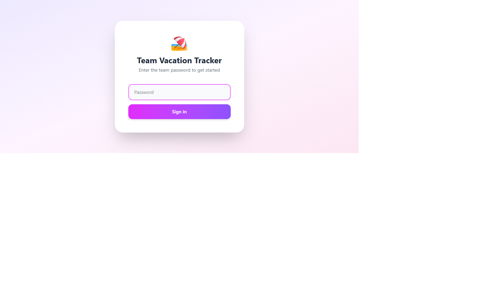
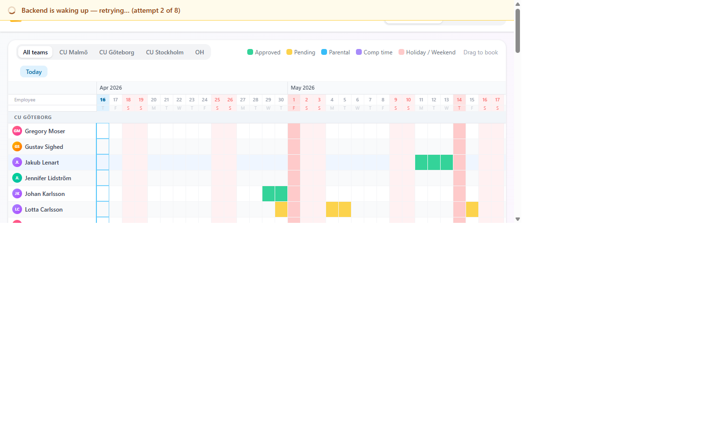
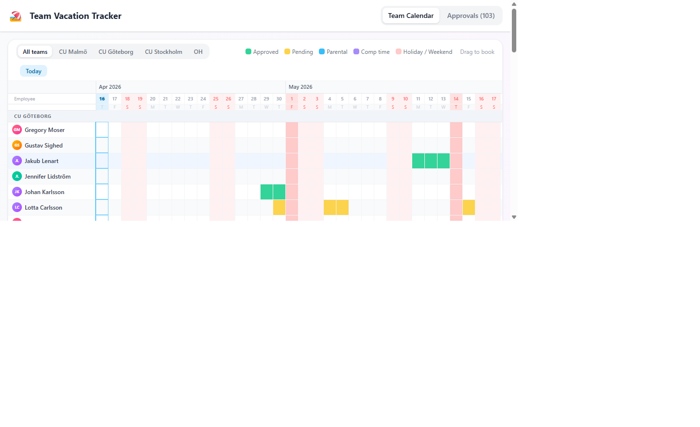
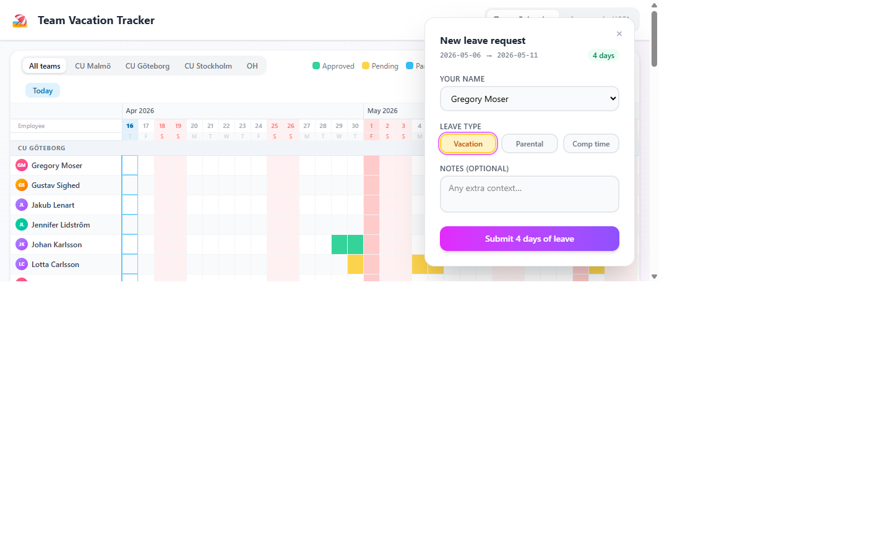
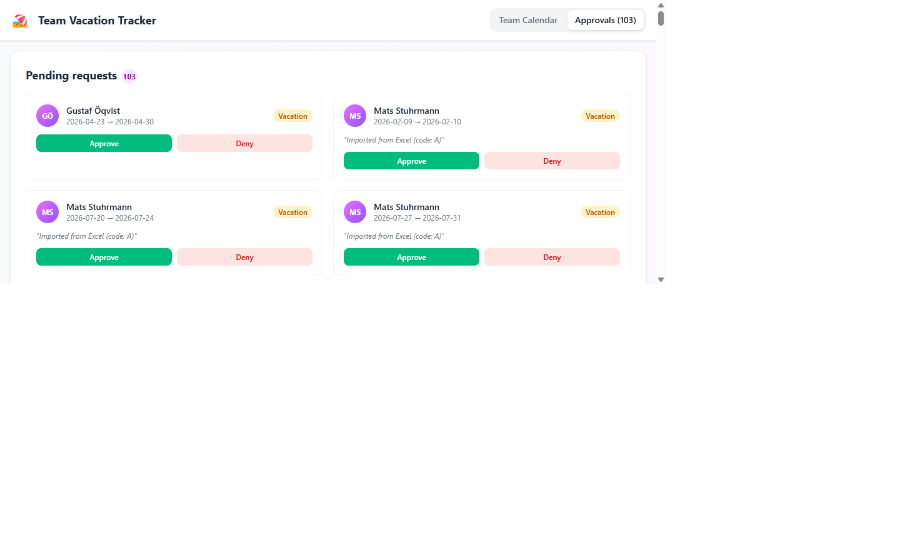
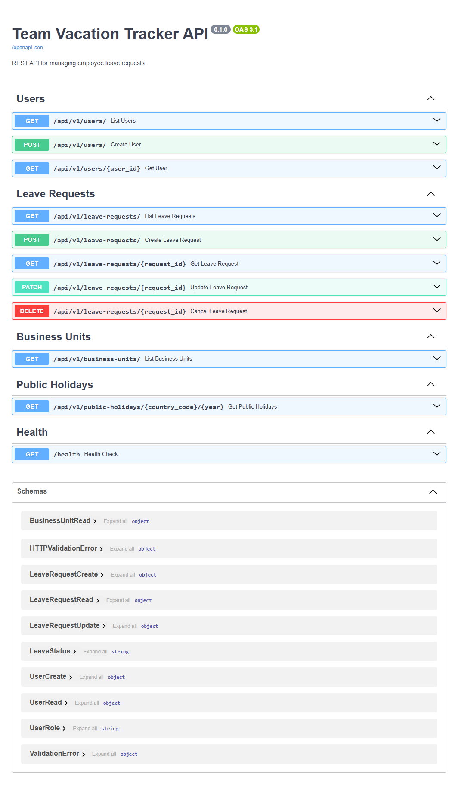

# Team Vacation Tracker

A web application that replaces a manual Excel-based vacation tracking system for a 57-person Swedish consulting team. Built with React (TypeScript), FastAPI, and Azure Cosmos DB — deployed on Azure Container Apps with scale-to-zero.

**Deployment note:** Production frontend and backend URLs are deployment outputs from Azure Container Apps. Do not hardcode environment-generated FQDNs in code or docs; redeploys can change them.

---

## Table of Contents

1. [Project Overview](#1-project-overview)
2. [App Walkthrough](#2-app-walkthrough)
3. [Tech Stack & Architecture](#3-tech-stack--architecture)
4. [Repository Structure](#4-repository-structure)
5. [Getting Started](#5-getting-started)
6. [Leave Categories](#6-leave-categories)
7. [Roles & Permissions](#7-roles--permissions)
8. [Workflow & Notifications](#8-workflow--notifications)
9. [Agile Sprint Plan](#9-agile-sprint-plan)
10. [Azure Infrastructure](#10-azure-infrastructure)
11. [Contributing](#11-contributing)

---

## 1. Project Overview

Team Vacation Tracker replaces a complex, shared Excel file that 57 employees used to track vacation, parental leave, and comp time across four business units (CU Malmö, CU Göteborg, CU Stockholm, and OH).

### What it does today

- **Gantt-style team calendar** — a horizontally scrollable timeline showing up to 6 months of leave for all 57 team members, grouped by business unit. Approved leave is shown in green, pending in amber, parental in sky-blue, comp time in violet. Swedish public holidays from [Nager.Date](https://date.nager.at/) are automatically highlighted in red.
- **Drag to book** — click and drag across any row to select a date range. A corner HUD appears (without dimming the calendar) to confirm the employee name, leave type, and optional notes before submitting.
- **Manager approvals dashboard** — a separate tab lists all pending requests with one-click Approve / Deny buttons.
- **Business unit filters** — quickly narrow the calendar to a single CU.
- **Jump to Today** — scrolls the timeline so today's column is in view.
- **Scale-to-zero aware** — the app displays an amber loading banner with a spinner while the backend Container App wakes up, and auto-retries up to 8 times before showing an error.
- **780 historical leave records** imported from the existing Excel file, giving the team an immediate view of past bookings.

### What is planned

- Full Microsoft Entra ID (SSO) authentication replacing the current shared password gate.
- Email notifications to managers when new requests are submitted (Azure Communication Services is provisioned and integrated, pending Entra setup).
- Personal leave balance view (read from the separate "Catalyst" HR system).

---

## 2. App Walkthrough

### Login screen

The app is currently protected by a shared team password. Future versions will use Microsoft Entra ID SSO.



---

### Cold-start / loading banner

Both Container Apps are configured with `min-replicas = 0`. When the backend scales up from zero, an amber banner appears while the app retries in the background — no blank screen, no manual refresh needed.



---

### Team calendar

After data loads, the full Gantt calendar is shown. Rows are grouped by business unit, weekends and public holidays are shaded red, and today's column is pinned with a sky-blue border. Hovering any row highlights it in blue. The legend, BU filter tabs, and "Today" jump button sit above the grid.



---

### Booking a leave request (corner HUD)

Clicking and dragging across cells on any row opens a compact HUD panel in the bottom-right corner — the calendar behind it stays fully visible and interactive. The panel pre-fills the employee name based on which row was dragged, shows the selected date range and working-day count, and lets the user choose vacation, parental, or comp-time leave before submitting.



---

### Manager approvals

The **Approvals** tab lists all pending requests with the employee name, date range, leave type, and Approve / Deny buttons. The badge in the navigation tab shows the live count of pending items.



---

### Backend API (OpenAPI / Swagger)

The FastAPI backend exposes a fully documented REST API. Swagger UI is available at `/docs`.



---

## 3. Tech Stack & Architecture

| Layer | Technology |
|---|---|
| **Frontend** | React (TypeScript) — component-based, highly responsive UI |
| **Backend** | FastAPI (Python) — async REST APIs |
| **Database** | Azure Cosmos DB (Serverless Free Tier), NoSQL or PostgreSQL API |
| **Hosting** | Azure Container Apps (serverless containers) |
| **Authentication** | Microsoft Entra ID (Single Sign-On) |
| **Email Service** | Azure Communication Services (or SendGrid) |
| **Backups** | Cosmos DB Continuous Backup (Point-in-Time Restore) |
| **CI/CD** | GitHub Actions |

### High-Level Architecture

```
┌─────────────────────────────────────────────────────┐
│                  Azure Container Apps                │
│  ┌──────────────┐   /api/*  ┌──────────────────────┐ │
│  │ React + Nginx│ ─────────>│  FastAPI Backend     │ │
│  │  (Frontend)  │  proxy    │  (Backend)           │ │
│  └──────────────┘           └──────────┬───────────┘ │
│                                       │             │
│                             ┌─────────▼──────────┐  │
│                             │  Azure Cosmos DB   │  │
│                             └────────────────────┘  │
└─────────────────────────────────────────────────────┘
         │                          │
         ▼                          ▼
  Microsoft Entra ID       Azure Communication Services
  (Authentication)         (Email Notifications)
```

---

## 4. Repository Structure

```
holidays/
├── README.md                        # This file
├── .gitignore
├── .github/
│   └── workflows/
│       ├── ci-backend.yml           # Backend lint, test, build
│       └── ci-frontend.yml          # Frontend lint, test, build
│
├── backend/                         # FastAPI Python application
│   ├── Dockerfile
│   ├── requirements.txt
│   ├── pyproject.toml
│   ├── app/
│   │   ├── main.py                  # FastAPI app entry point
│   │   ├── config.py                # Settings / environment variables
│   │   ├── auth/
│   │   │   └── entra.py             # Microsoft Entra ID integration
│   │   ├── api/
│   │   │   └── v1/
│   │   │       ├── users.py         # User endpoints
│   │   │       ├── leave_requests.py# Leave request CRUD endpoints
│   │   │       ├── business_units.py# Business unit endpoints
│   │   │       └── public_holidays.py # Public holiday proxy endpoints
│   │   ├── core/
│   │   │   └── dependencies.py     # Shared FastAPI dependencies
│   │   ├── db/
│   │   │   └── cosmos.py           # Cosmos DB client & helpers
│   │   ├── models/
│   │   │   ├── user.py             # User domain model
│   │   │   ├── leave_request.py    # LeaveRequest domain model
│   │   │   └── business_unit.py    # BusinessUnit domain model
│   │   ├── schemas/
│   │   │   ├── user.py             # Pydantic request/response schemas
│   │   │   ├── leave_request.py
│   │   │   └── business_unit.py
│   │   ├── services/
│   │   │   ├── email.py            # Email sending via ACS / SendGrid
│   │   │   └── notifications.py    # Notification trigger logic
│   │   └── utils/
│   │       └── holidays.py         # Public holiday API client (Nager.Date)
│   └── tests/
│       ├── conftest.py
│       └── test_leave_requests.py
│
├── frontend/                        # React TypeScript application
│   ├── Dockerfile
│   ├── package.json
│   ├── tsconfig.json
│   ├── public/
│   │   └── index.html
│   └── src/
│       ├── index.tsx                # App entry point
│       ├── App.tsx                  # Root component + routing
│       ├── api/
│       │   ├── client.ts           # Axios/fetch base client
│       │   └── leaveRequests.ts    # Leave request API calls
│       ├── auth/
│       │   └── msalConfig.ts       # MSAL (Entra ID) configuration
│       ├── components/
│       │   ├── Calendar/
│       │   │   ├── Calendar.tsx    # Interactive calendar component
│       │   │   └── Calendar.css
│       │   ├── TeamView/
│       │   │   └── TeamView.tsx    # Read-only team calendar
│       │   └── ManagerDashboard/
│       │       └── ManagerDashboard.tsx # Approval dashboard
│       ├── hooks/
│       │   └── usePublicHolidays.ts # Hook to fetch public holidays
│       ├── pages/
│       │   ├── Home.tsx
│       │   └── Dashboard.tsx
│       └── types/
│           └── index.ts            # Shared TypeScript types
│
├── scripts/
│   ├── migrate_legacy_data.py       # One-time Excel → Cosmos DB migration
│   └── seed_db.py                   # Seed database with test data
│
├── infra/
│   ├── main.bicep                   # Azure Bicep IaC for all resources
│   └── README.md                    # Infrastructure deployment guide
│
└── docs/
    ├── architecture.md              # Detailed architecture decisions
    ├── api.md                       # API reference
    └── sprint-plan.md               # Agile sprint breakdown
```

---

## 5. Getting Started

### Prerequisites

- Python 3.11+
- Node.js 20+
- Docker & Docker Compose
- Azure CLI (for infrastructure provisioning)

### Backend (FastAPI)

```bash
cd backend
python -m venv .venv
source .venv/bin/activate        # Windows: .venv\Scripts\activate
pip install -r requirements.txt
cp .env.example .env             # Fill in your environment variables
uvicorn app.main:app --reload
```

API docs available at `http://localhost:8000/docs`

### Frontend (React)

```bash
cd frontend
npm install
cp .env.example .env.local       # Fill in your environment variables
npm run dev
```

App available at `http://localhost:5173`

Auth mode behavior:

- PasswordGate mode (default): active when `VITE_ENTRA_CLIENT_ID` and `VITE_ENTRA_TENANT_ID` are not both configured.
- Entra mode: active only when both `VITE_ENTRA_CLIENT_ID` and `VITE_ENTRA_TENANT_ID` are set.

### Running with Docker Compose

```bash
docker compose up --build
```

### Production Connectivity Contract

- Browsers should call the frontend origin only. Production API traffic goes through same-origin `/api/v1/*` routes.
- The frontend container uses nginx to proxy `/api/*` to the backend origin provided at runtime via `BACKEND_ORIGIN`.
- `BACKEND_ORIGIN` must be the backend HTTPS origin with no trailing slash.
- `VITE_API_BASE_URL` remains a local-development convenience only. It should not be relied on for deployed frontend traffic.
- Do not hardcode Azure Container Apps FQDNs in frontend code, nginx config, or documentation.

### Running Tests

```bash
# Backend
cd backend && pytest

# Frontend
cd frontend && npm test
```

---

## 6. Leave Categories

| Code | Description |
|------|-------------|
| `A` | Requested — pending manager approval |
| `B` | Approved — official vacation |
| `FL` | Parental Leave (*Föräldraledighet*) |
| `C` | Comp time (*Kompis* / free comp hours) |

---

## 7. Roles & Permissions

| Role | Permissions |
|------|-------------|
| **Employee** | View team calendar; request leave; cancel own *pending* requests |
| **Manager** | View department requests; approve/deny leaves; view historical team data |
| **Admin** | Manually adjust balances; assign managers; manage system settings |

---

## 8. Workflow & Notifications

### Automated Manager Routing (by Business Unit)

Manager routing is configured in `backend/org_config.yaml` (not committed — see `org_config.example.yaml`).

| Business Unit | Description |
|---|---|
| CU Malmö | Consultant Unit — Malmö office |
| CU Göteborg | Consultant Unit — Gothenburg office |
| CU Stockholm | Consultant Unit — Stockholm office |
| OH | Overhead — internal/non-billable staff |
| PL | Poland — staff on external client projects |

### Email Magic Links
When an employee requests leave, FastAPI sends a rich-text email to the designated manager containing:
- Employee name
- Requested dates
- Leave type
- A direct magic link to the approval dashboard

---

## 9. Agile Sprint Plan

### Sprint 1 — Infrastructure & Authentication (Weeks 1–2)
- Provision Azure Container Apps, Cosmos DB Serverless.
- Set up GitHub Actions CI/CD pipeline.
- Initialize React frontend and FastAPI backend.
- Implement Microsoft Entra ID authentication on both frontend and backend.

### Sprint 2 — Database Schema & Legacy Import (Weeks 3–4)
- Design Cosmos DB schemas for `Users`, `LeaveRequests`, and `BusinessUnits`.
- Write one-time Python migration script (`scripts/migrate_legacy_data.py`) to parse Excel/CSV files and seed Cosmos DB with historical data.
- Implement basic CRUD endpoints in FastAPI.

### Sprint 3 — Frontend Calendar & Public Holidays (Weeks 5–6)
- Build the core React `Calendar` component.
- Integrate the Nager.Date public holiday API to dynamically block red days.
- Connect the calendar to the backend to render existing user data.

### Sprint 4 — Request Workflow & Team View (Weeks 7–8)
- Implement drag-and-drop / multi-select UI for requesting leave.
- Build the "Team View" interface for employees.
- Develop backend logic to capture requests and set them to state `A` (Requested).

### Sprint 5 — Notifications & Manager Approvals (Weeks 9–10)
- Set up Azure Communication Services / SendGrid email provider.
- Build notification trigger in FastAPI to email managers when requests arrive.
- Develop the Manager Dashboard in React for reviewing and approving/denying requests.

### Sprint 6 — Polish, UAT & Launch (Weeks 11–12)
- Enable Cosmos DB Point-in-Time Restore (PITR) backups.
- Finalize UI/UX design (colors, loading states, error handling).
- Conduct User Acceptance Testing (UAT) with a small group of employees.
- Final deployment to Azure Container Apps and full team rollout.

---

## 10. Azure Infrastructure

Container Apps are deployed per environment, for example **`rg-holidays-prod`** for production. Treat Azure Container Apps FQDNs as runtime outputs, not source-controlled configuration.

### Provisioned Resources

The names below are example environment resources from an existing deployment history, not values that should be copied verbatim into code or docs.

| Resource Name | Type | Location | Purpose |
|---|---|---|---|
| `cosmos-holidays-dev-001` | Azure Cosmos DB (NoSQL) | Sweden Central | Primary database — `vacation-tracker` DB with `Users`, `LeaveRequests`, `BusinessUnits` containers |
| `acs-holidays-dev-001` | Azure Communication Services | Global (data: Europe) | Transactional email for leave notifications |
| `crholdaysdev001` | Azure Container Registry | Sweden Central | Docker image registry for backend & frontend (`crholdaysdev001.azurecr.io`) |
| `log-holidays-dev-001` | Log Analytics Workspace | Sweden Central | Centralised logging (manually created) |
| `workspace-rgholidaysPpiL` | Log Analytics Workspace | North Europe | Auto-created by Container Apps Environment |
| `cae-holidays-dev-001` | Container Apps Environment | North Europe | Runtime host for environment-specific Azure Container Apps default domains |

> **Note:** Backend and frontend Container Apps must be deployed together with the frontend runtime variable `BACKEND_ORIGIN` pointed at the active backend HTTPS origin.

### Recreating the Infrastructure

```bash
# 1. Log in and set subscription
az login
az account set --subscription 90a112e9-de6b-4011-be14-2cf8943a9ec8

# 2. Resource group
az group create --name rg-holidays --location swedencentral

# 3. Cosmos DB (NoSQL, serverless)
az cosmosdb create \
  --name cosmos-holidays-dev-001 \
  --resource-group rg-holidays \
  --kind GlobalDocumentDB \
  --capabilities EnableServerless \
  --locations regionName=swedencentral

az cosmosdb sql database create \
  --account-name cosmos-holidays-dev-001 \
  --resource-group rg-holidays \
  --name vacation-tracker

for container in Users LeaveRequests BusinessUnits; do
  az cosmosdb sql container create \
    --account-name cosmos-holidays-dev-001 \
    --resource-group rg-holidays \
    --database-name vacation-tracker \
    --name $container \
    --partition-key-path /id
done

# 4. Azure Communication Services
az communication create \
  --name acs-holidays-dev-001 \
  --resource-group rg-holidays \
  --location global \
  --data-location Europe

# 5. Container Registry
az acr create \
  --name crholdaysdev001 \
  --resource-group rg-holidays \
  --sku Basic \
  --location swedencentral

# 6. Log Analytics
az monitor log-analytics workspace create \
  --name log-holidays-dev-001 \
  --resource-group rg-holidays \
  --location swedencentral

# 7. Container Apps Environment (northeurope — capacity availability)
az containerapp env create \
  --name cae-holidays-dev-001 \
  --resource-group rg-holidays \
  --location northeurope
```

### Local Development Setup

```bash
# Backend
cd backend
# Use uv with the repo-level .venv
uv venv ../.venv          # already exists — skip if present
uv pip install -r requirements.txt
cp .env.example .env      # then fill in real values (see below)
uvicorn app.main:app --reload

# Frontend
cd frontend
npm install
cp .env.example .env.local   # then fill in real values
npm run dev
```

### Environment Variables

Copy the example files and populate them — **do not commit the filled-in versions**:

| File | Committed | Purpose |
|---|---|---|
| `backend/.env.example` | ✅ Yes | Template with all required keys |
| `backend/.env` | ❌ No | Real secrets & infrastructure URLs |
| `backend/org_config.yaml` | ❌ No | PII — employee names, emails, BU assignments |
| `backend/org_config.example.yaml` | ✅ Yes | Template for `org_config.yaml` |
| `frontend/.env.example` | ✅ Yes | Template for frontend Vite variables |
| `frontend/.env.local` | ❌ No | Real Entra ID client IDs for local dev |

### Production Runtime Variables

These values are injected by the container platform during deployment rather than committed to the repo:

| Variable | App | Required | Purpose |
|---|---|---|---|
| `BACKEND_ORIGIN` | Frontend container | ✅ Yes | nginx proxy target for same-origin `/api/*` requests in deployed environments |
| `VITE_API_BASE_URL` | Frontend local dev only | Local only | Direct Vite-to-backend URL for `npm run dev`; not used for deployed frontend traffic |
| `VITE_ENTRA_CLIENT_ID` | Frontend | Optional | Enables Entra auth mode when paired with `VITE_ENTRA_TENANT_ID` |
| `VITE_ENTRA_TENANT_ID` | Frontend | Optional | Enables Entra auth mode when paired with `VITE_ENTRA_CLIENT_ID` |
| `VITE_ENTRA_REDIRECT_URI` | Frontend | Optional | Redirect URI used by MSAL; defaults to current origin |
| `FRONTEND_URL` | Backend | Recommended | Canonical frontend URL for email links and as the default direct-call origin |
| `FRONTEND_ALLOWED_ORIGINS` | Backend | Optional | Comma-separated override for direct backend CORS callers when more than one frontend/admin origin must be allowed |

### Deploy / Redeploy Checklist

```bash
# Validate before deploying
cd frontend && npm run build
cd ..
az bicep build --file infra/main.bicep

# Deploy infrastructure or update Container App configuration
az deployment group create \
  --resource-group <resource-group> \
  --template-file infra/main.bicep \
  --parameters \
      namePrefix="vactracker" \
      containerRegistryServer="<registry-server>" \
      backendImageTag="<backend-tag>" \
      frontendImageTag="<frontend-tag>"

# Verify active revisions
az containerapp revision list -g <resource-group> -n <frontend-app> -o table
az containerapp revision list -g <resource-group> -n <backend-app> -o table

# Smoke-test the deployed path through the frontend origin
curl -i https://<frontend-fqdn>/api/v1/public-holidays/SE/2026
curl -I https://<frontend-fqdn>/api/v1/exports/leave-requests.csv
curl -i https://<backend-fqdn>/health
```

If the frontend loads but API calls fail after a redeploy, check these first:

- The frontend container revision has `BACKEND_ORIGIN` set to the current backend HTTPS origin.
- The nginx config in the frontend image still uses runtime templating, not a hardcoded backend hostname.
- The browser is calling same-origin `/api/*`, not a baked backend URL.
- If you are using direct backend callers or generating notification links, the backend runtime values for `FRONTEND_URL` and optional `FRONTEND_ALLOWED_ORIGINS` still match the active frontend deployment.

---

## 11. Contributing

1. Fork the repository and create a feature branch from `main`.
2. Follow the coding standards described in `docs/architecture.md`.
3. Ensure all tests pass before opening a pull request.
4. Reference the relevant sprint/issue in your PR description.
